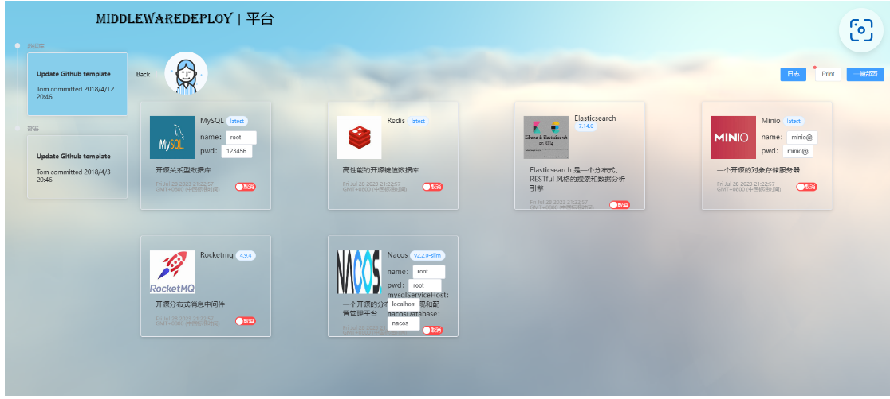

# middlewareDeploy-platform
middlewareDeploy-platform

项目技术架构：springboot3、netty、freemarker、设计模式等。

自主研发的一款中间件控制面板可以部署中间件。不过后续增加也很方便。代码满足开闭原则，变量集中化。

本控制面板基于yum 命令和docker compose来实现中间件的部署 、后续还会跟进 语言环境啊、以及更多中间件的集成。当然欢迎更多道友加入

本项目 已经打包为一个exe 使用jdk17 的新特性 用户操作简便、只需安装exe文件 后续只需点点点 即可完成对中间件的部署。

项目的首页：

连接进入中间件页面：

springboot 部署页面：

1、可以实现单体服务的部署，用户只需要输入本地windows上的jar 包位置 点击部署即可实现部署。十分的nice哦

点击一键部署后会有对应的实时日志：

